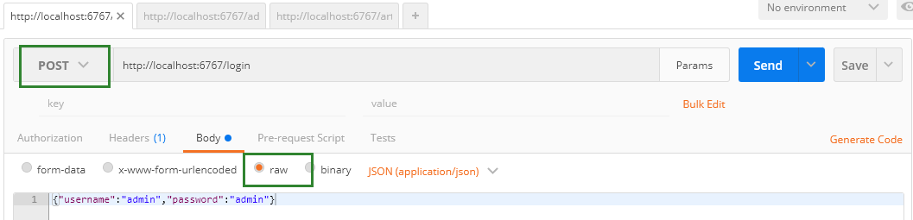
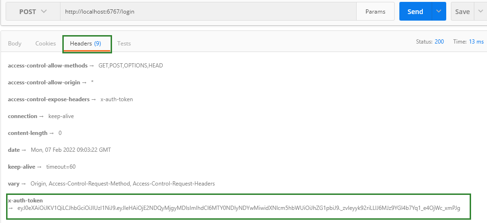
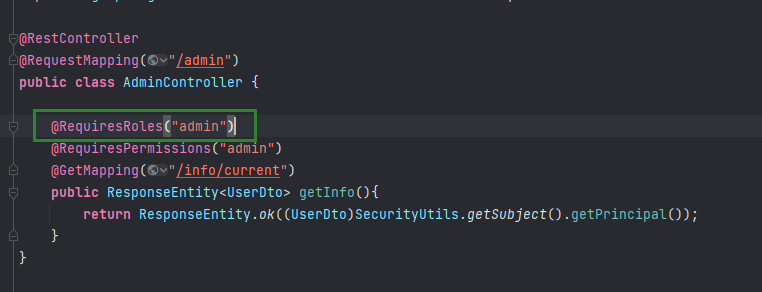
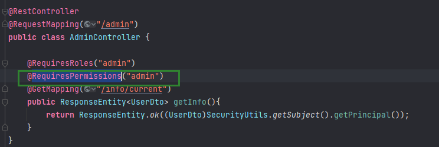

# Shiro and JWT
结合SpringBoot、Shiro和JWT实现的无状态用户访问控制
- 使用shiro做登录和权限验证
- 使用jwt做无状态应用的用户校验
- 禁用session
- 支持跨域访问

# 启动项目
- 首先安装mysql和redis（redis也可不装，但是本项目中需要注释掉redis的依赖以及相关代码）
- 刷入项目文件根目录下的db目录，分别刷入sql脚本schema.sql和data.sql
- 启动项目
- 访问 __http://localhost:6767/login__ 按照如下图写入登录账号密码

- 登陆成功返回结果如下图所示（header中提取token）：

# 附加权限
###角色表

| ID    |  代码  | 名称  |
| :---: | :---- | ---- |
| 1  | admin | 超级管理员 |

####代码实例
`@RequiresRoles("admin")`

###权限表

| ID    |  代码  | 名称  |
| :---: | :---- | ---- |
| 1  | admin | 超级管理员 |

####代码实例
`@RequiresPermissions("admin")`

